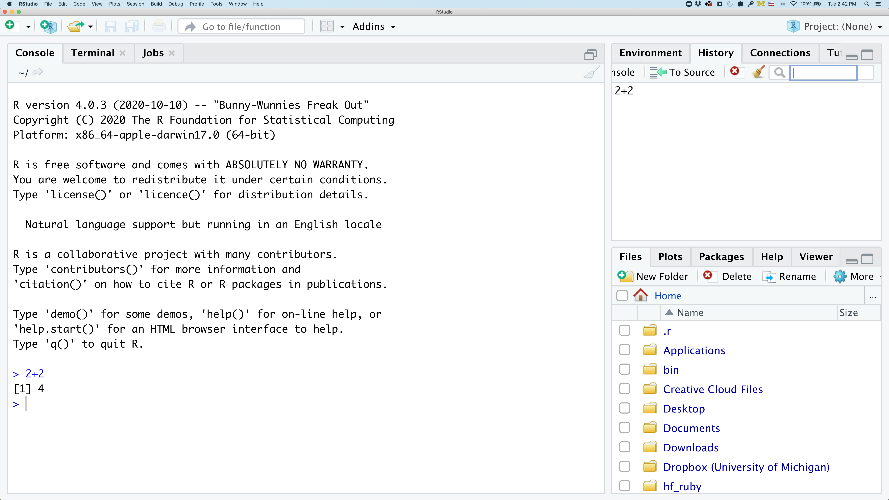
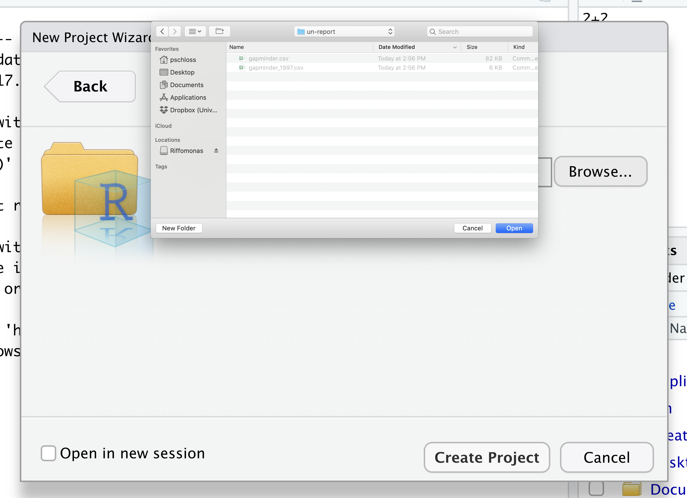
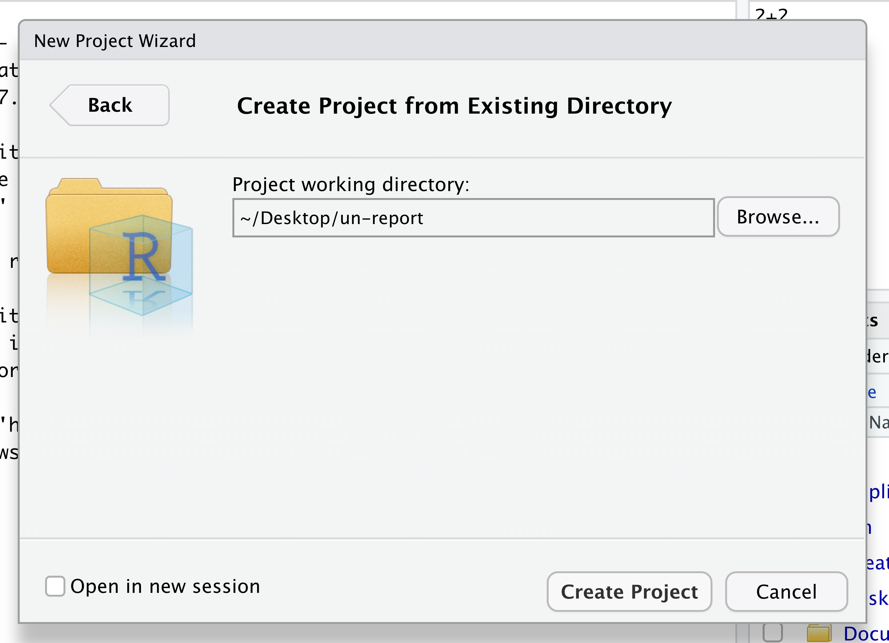

```{r, include=FALSE}
knitr::opts_chunk$set(fig.path = 'figures/')
```

### Contents

1. [Introduction to R and RStudio](#introduction-to-r-and-rstudio)
1. [Loading and reviewing data](#loading-and-reviewing-data)
1. [Understanding commands](#understanding-commands)

# Introduction to R and RStudio
_[Back to top](#contents)_

In this workshop, we will analyze an RNAseq dataset.
To do this, we'll need two things: data and a platform to analyze the data.

You already [downloaded the data]({{ page.root }}/setup.html). But what platform will we use to analyze the data? We have many options!

We could try to use a spreadsheet program like Microsoft Excel or Google sheets that have limited access, less flexibility, and don't easily allow for things that are critical to ["reproducible" research](https://journals.plos.org/ploscompbiol/article?id=10.1371/journal.pcbi.1003285), like easily sharing the steps used to explore and make changes to the original data.

Instead, we'll use a programming language to test our hypothesis. Today we will use R, but we could have also used Python for the same reasons we chose R (and we teach workshops for both languages). Both R and Python are freely available, the instructions you use to do the analysis are easily shared, and by using reproducible practices, it's straightforward to add more data or to change settings like colors or the size of a plotting symbol.

To run R, all you really need is the R program, which is available for computers running the Windows, Mac OS X, or Linux operating systems. You downloaded R while getting [set up]({{ page.root }}/setup.html) for this workshop.

To make your life in R easier, there is a great (and free!) program called RStudio that you also downloaded and used during [set up]({{ page.root }}/setup.html). As we work today, we'll use features that are available in RStudio for writing and running code, managing projects, installing packages, getting help, and much more. It is important to remember that R and RStudio are different, but complementary programs. You need R to use RStudio.

To get started, we'll spend a little time getting familiar with the RStudio environment and setting it up to suit your tastes. When you start RStudio, you'll have three panels.

```{r initial_rstudio, out.width='700px'}
knitr::include_graphics("images/r-plotting/initial_rstudio.png")
```

On the left you'll have a panel with three tabs - Console, Terminal, and Jobs. The Console tab is what running R from the command line looks like. This is where you can enter R code. Try typing in `2+2` at the prompt (>). In the upper right panel are tabs indicating the Environment, History, and a few other things. If you click on the History tab, you'll see the command you ran at the R prompt.



In the lower right panel are tabs for Files, Plots, Packages, Help, and Viewer. You used the Packages tab to install tidyverse.

We'll spend more time in each of these tabs as we go through the workshop, so we won't spend a lot of time discussing them now.

You might want to alter the appearance of your RStudio window. The default appearance has a white background with black text. If you go to the Tools menu at the top of your screen, you'll see a "Global options" menu at the bottom of the drop down; select that.


From there you will see the ability to alter numerous things about RStudio. Under the Appearances tab you can select the theme you like most. As you can see there's a lot in Global options that you can set to improve your experience in RStudio. Most of these settings are a matter of personal preference.

However, you can update settings to help you to insure the reproducibility of your code. In the General tab, none of the selectors in the R Sessions, Workspace, and History should be selected. In addition, the toggle next to "Save workspace to .RData on exit" should be set to never. These setting will help ensure that things you worked on previously don't carry over between sessions.


Let's get going on our analysis!

One of the helpful features in RStudio is the ability to create a project. A project is a special directory that contains all of the code and data that you will need to run an analysis.

At the top of your screen you'll see the "File" menu. Select that menu and then the menu for "New Project...".


When the smaller window opens, select "Existing Directory" and then the "Browse" button in the next window.


Navigate to the directory that contains your code and data from the setup instructions and click the "Open" button.



Then click the "Create Project" button.



Did you notice anything change?

In the lower right corner of your RStudio session, you should notice that your
Files tab is now your project directory. You'll also see a file called
un-report.Rproj in that directory.

From now on, you should start RStudio by double clicking on that file. This will
make sure you are in the correct directory when you run your analysis.


We'd like to create a file where we can keep track of our R code.

Back in the "File" menu, you'll see the first option is "New File". Selecting "New File" opens another menu to the right and the first option is "R Script". Select "R Script".

Now we have a fourth panel in the upper left corner of RStudio that includes an **Editor** tab with an untitled R Script. Let's save this file as `intro.R` in our project directory.

We will be entering R code into the **Editor** tab to run in our **Console** panel.

On line 1 of `intro.R`, type `2+2`.

With your cursor on the line with the `2+2`, click the button that says <kbd>Run</kbd>. You should be able to see that `2+2` was run in the Console.

As you write more code, you can highlight multiple lines and then click <kbd>Run</kbd> to run all of the lines you have selected.

You can use R like a calculator to add (`+`), multiply (`*`), divide (`/`), and more!

# Variables and Types

- character
- logical
- double

```{r types}
name <- "Kelly"
favorite_color <- "green"
height_inches <- 64
likes_cats <- TRUE
num_plants <- 14L
```

You can think of variables as labelled boxes where you store your belongings.

The `<-` symbol is the **assignment operator**. It assigns values generated or typed on the right to objects on the left. An alternative symbol that you might see used as an **assignment operator** is the `=` but it is clearer to only use `<-` for assignment. We use this symbol so often that RStudio has a keyboard short cut for it: <kbd>Alt</kbd>+<kbd>-</kbd> on Windows, and <kbd>Option</kbd>+<kbd>-</kbd> on Mac.

If you're not sure of the type of a variable, 
you can find out with the `typeof()` function.

```{r}
typeof(name)
typeof(favorite_color)
typeof(height_inches)
typeof(likes_cats)
```

> ## Assigning values to objects
> Try to assign values to some objects and observe each object after you have assigned a new value. What do you notice?
>
> ```{r Objects, eval = FALSE}
> name <- "Ben"
> name
> height <- 72
> height
> name <- "Jerry"
> name
> ```
>
> > ## Solution
> > When we assign a value to an object, the object stores that value so we can access it later. However, if we store a new value in an object we have already created, it replaces the old value. The `height` object does not change, because we never assign it a new value.


> ## Guidelines on naming objects
> - You want your object names to be explicit and not too long.
> - They cannot start with a number (2x is not valid, but x2 is).
> - R is case sensitive, so for example, weight_kg is different from Weight_kg.
> - You cannot use spaces in the name.
> - There are some names that cannot be used because they are the names of fundamental functions in R (e.g., if, else, for; see [here](https://stat.ethz.ch/R-manual/R-devel/library/base/html/Reserved.html) for a complete list). If in doubt, check the help to see if the name is already in use (`?function_name`).
> - It's best to avoid dots (.) within names. Many function names in R itself have them and dots also have a special meaning (methods) in R and other programming languages.
> - It is recommended to use nouns for object names and verbs for function names.
> - Be consistent in the styling of your code, such as where you put spaces, how you name objects, etc. Using a consistent coding style makes your code clearer to read for your future self and your collaborators. One popular style guide can be found through the [tidyverse](https://style.tidyverse.org/).
{: .checklist}

Math works the way you'd expect it to (mostly).

```{r}
cm_per_inch <- 2.54
height_cm <- height_inches * cm_per_inch
height_inches2 <- height_cm / cm_per_inch
```


The above variables hold a single value. What if you need multiple values?

```{r}
dial_numbers <- c(1, 2, 3)
dial_numbers2 <- 1:3
typeof(dial_numbers)
fan_settings <- c('low', 'medium', 'high')
typeof(fan_settings)
fan_settings <- factor(c('low', 'high', 'medium', 'high', 'medium'), levels = c('low', 'medium', 'high'))
```


# Understanding functions

> ## Pro-tip
>
> Each function has a help page that documents what arguments the function
> expects and what value it will return. You can bring up the help page a few
> different ways. If you have typed the function name in the **Editor** windows,
> you can put your cursor on the function name and press <kbd>F1</kbd> to open
> help page in the **Help** viewer in the lower right corner of RStudio. You can
> also type `?` followed by the function name in the console.
>
> For example, try running `?typeof`. A help page should pop up with
> information about what the function is used for and how to use it, as well as
> useful examples of the function in action. As you can see, the first
> **argument** of `type` is the variable name.
>

The `typeof()` function took the variable we provided and told us the `type` that the variable belonged to.

Do all functions need arguments? Let's test some other functions:

```{r FunctionsNoArgs}
  Sys.Date()
  getwd()
```


While some functions don't need any arguments, in other
functions we may want to use multiple arguments. When we're using multiple
arguments, we separate the arguments with commas. For example, we can use the
`sum()` function to add numbers together:

```{r sumFunctionExample}
sum(5, 6)
```

> ## Learning more about functions
> Look up the function `round`. What does it do? What will you get as output for the following lines of code?
>
> ```{r functionExercise, eval = FALSE}
> round(3.1415)
> round(3.1415,3)
> ```
>
> > ## Solution
> > `round` rounds a number. By default, it rounds it to zero digits (in our example above, to 3). If you give it a second number, it rounds it to that number of digits (in our example above, to 3.142)


> ## Position of the arguments in functions
> Which of the following lines of code will give you an output of 3.14? For the one(s) that don't give you 3.14, what do they give you?
>
> ```{r functionPositionExercise, eval = FALSE}
> round(x = 3.1415)
> round(x = 3.1415, digits = 2)
> round(digits = 2, x = 3.1415)
> round(2, 3.1415)
> ```
>
> > ## Solution
> > The 2nd and 3rd lines will give you the right answer because the arguments are named, and when you use names the order doesn't matter. The 1st line will give you 3 because the default number of digits is 0. Then 4th line will give you 2 because, since you didn't name the arguments, x=2 and digits=3.1415.


Sometimes it is helpful - or even necessary - to include the argument name, but often we can skip the argument name, if the argument values are passed in a certain order. If all this function stuff sounds confusing, don't worry! We'll see a bunch of examples as we go that will make things clearer.


> ## Comments
> Sometimes you may want to write comments in your code to help you remember
> what your code is doing, but you don't want R to think these comments are a part
> of the code you want to evaluate. That's where **comments** come in! Anything
> after a `#` symbol in your code will be ignored by R. For example, let's say we
> wanted to make a note of what each of the functions we just used do:
> ```{r FunctionsComments2}
>  Sys.Date()  # outputs the current date
>  getwd()     # outputs our current working directory (folder)
>  sum(5, 6)   # adds numbers
> ```
{: .callout}


# Packages

TODO

Let's load our first package, the tidyverse with `library(tidyverse)`.

Go ahead and run that line in the **Console** by clicking the <kbd>Run</kbd> button on the top right of the **Editor** tab and choosing <kbd>Run Selected Lines</kbd>. This loads a set of useful functions and sample data that makes it easier for us to do complex analyses and create professional visualizations in R.

```{r loadTidyverse, message=TRUE}
library(tidyverse)
```

> ## What's with all those messages???
>
> When you loaded the `tidyverse` package, you probably got a message like the
> one we got above. Don't panic! These messages are just giving you more
> information about what happened when you loaded `tidyverse`. The `tidyverse` is
> actually a collection of several different packages, so the first section of the
> message tells us what packages were installed when we loaded `tidyverse` (these
> include `ggplot2`, `dyplr`, and `tidyr`, which we will use a lot!
>
> The second section of messages gives a list of "conflicts." Sometimes, the
> same function name will be used in two different packages, and R has to decide
> which function to use. For example, our message says that:
>
> ~~~
> dplyr::filter() masks stats::filter()
> ~~~
>
> This means that two different packages (`dyplr` from `tidyverse` and `stats`
> from base R) have a function named `filter()`. By default, R uses the function
> that was most recently loaded, so if we try using the `filter()` function after
> loading `tidyverse`, we will be using the `filter()` function > from `dplyr()`.


> ## The tidyverse vs Base R
> If you've used R before, you may have learned commands that are different than the ones we will be using during this workshop. We will be focusing on functions from the [tidyverse](https://www.tidyverse.org/). The "tidyverse" is a collection of R packages that have been designed to work well together and offer many convenient features that do not come with a fresh install of R (aka "base R"). These packages are very popular and have a lot of developer support including many staff members from RStudio. These functions generally help you to write code that is easier to read and maintain. We believe learning these tools will help you become more productive more quickly.


---

# Data frames & reading data from files
_[Back to top](#contents)_

The variable types we discussed above are useful for simple variables, but
what if you want to store attributes about lots of different things, like patient samples? 
For that we use data frames. Let's find out how to read in a dataset as a data frame.

TODO
- read.csv
- read_csv
- data.table::fread
- readxl::read_excel

> ## Data objects
> There are many different ways to store data in R. Most objects have a table-like structure with rows and columns. We will refer to these objects generally as "data objects". If you've used R before, you many be used to calling them "data.frames". Functions from the "tidyverse" such as `read_csv` work with objects called "tibbles", which are a specialized kind of "data.frame." Another common way to store data is a "data.table". All of these types of data objects (tibbles, data.frames, and data.tables) can be used with the commands we will learn in this lesson to make plots. We may sometimes use these terms interchangeably.
{: .callout}

`View()`
`dim()`
`nrow()`
`ncol()`